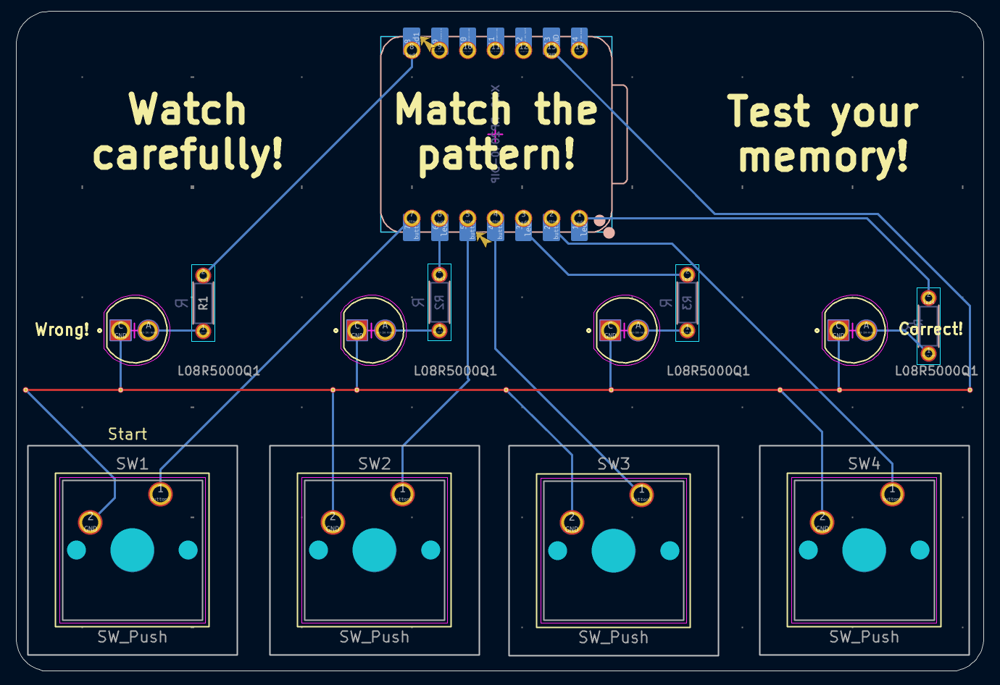

# Memory-Game-pathfinder

## Description
This is a memory game on a PCB. When the first button is pressed(labeled), a random sequence of 5-7 lights is generated. It will display this sequence on the LEDS. The player then has to press the buttons in that sequence. If the player presses a wrong button or doesn't press anything for more than 10 seconds, they lose(indicated by LEDS). If they press the correct sequence, they win(indicated by LEDS). The player can play again by pressing the first button.

## BOM(Bill of Materials)
* 1 XIAO RP2040
* 4 LEDS(L08R5000Q1)
* 4 Resistors
* 4 Buttons(Cherry MX Switches)

## Screenshots!

Schematic

PCB

")

3D Preview(front)

")

3D Preview(back)
